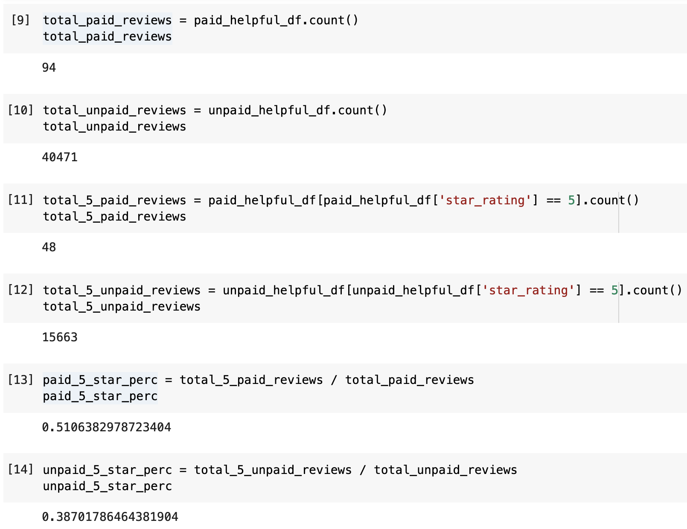

# Amazon Vine Analysis

## Overview of the analysis

The purpose of this analysis was to analyze Amazon reviews by members of the paid Amazon Vine program to see if there is any bias towards favorable reviews from Vine members.

## Results

- How many Vine reviews and non-Vine reviews were there?

There were 94 Vine reviews and 40,471 non-Vine reviews.

- How many Vine reviews were 5 stars? How many non-Vine reviews were 5 stars?

There were 48 Vine reviews that were 5 stars, while there were 15,663 non-Vine reviews that were 5 stars.

- What percentage of Vine reviews were 5 stars? What percentage of non-Vine reviews were 5 stars?

51.1% of the Vine reviews were 5 stars, while 38.7% of the non-Vine reviews were 5 stars.

## Summary

From the results above, there is some good evidence towards the idea that there is positivity bias in the Vine program reviews -- the proportion of 5 star reviews is higher for Vine reviews than for non-Vine reviews 51.1% to 38.7%.

To further support this, we could do a hypothesis test using the idea that the proportion of 5 star reviews. The null hypothesis would be that the 5 star review proportion is the same for both Vine and non-Vine reviews, while the alternate hypothesis is that there is a difference between them. Doing this would provide better evidence for whether there is an actual bias, which could just be random chance based solely on the numbers above.